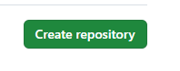
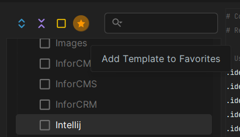

# ICTPRG302 Portfolio Work

This **Private** repository contains the work for ICTPRG302 Portfolio Parts 1 and 2.

## Contributors

- Adrian Gould (Lecturer) <adrian.gould@nmtafe.wa.edu.au>
- YOUR NAME (Student) <STUDENT_ID@tafe.wa.edu.au>


## Using Your Repository

Complete the exercise you have been requested to do in the Assessment.

Once it is working, make sure that the code has at least the following line before any code in Py4E.

```python
# YOUR_NAME, STUDENT ID
```

Make sure to replace:

- `YOUR_NAME` with your full name, and
- `STUDENT_ID` with your student ID.

We also suggest adding the following as the next line:

```python
# Py4E Exercise X.Y
```

Replacing the X.Y with the exercise number from the Assessment document.

Once you have it all working do the following:

- Create a new Python file in the correct chapter folder (e.g. Exercise 10.2 is placed in `ch-11`.) with the
  name `ex-X-Y.py` (e.g. Exercise 10.2 would be saved in a file `ex-10-2.py`.)
- Copy your Python code from Py4E and paste into your new file.
- Save the File (`CTRL`+`S`)
- Add the Python File to your repository using

```shell
git add ch-xx\ex-xx.py
```

Once all the exercises from the chapter are completed, complete these next steps:

- Tick off the exercise(s) in the `ReadMe.md` file,
- Use `git add` to add the `ReadMe.md` to staging,
- Commit the files using `git commit`, making sure that the `X` is replaced with the correct chapter number.

```shell
git commit -m "feat: Complete Chapter-X exercises."
```

# Checklist of Py4E Exercises

Replace the [ ] with [X] when you have completed the exercise.

- [ ] [Chapter 2](ch-02)
    - [ ] Py4E 1.1 (Hello World)
- [ ] [Chapter 3](ch-3)
    - [ ] Py4E 2.2
    - [ ] Py4E 2.3
- [ ] [Chapter 4](ch-4)
    - [ ] Py4E 3.1
    - [ ] Py4E 3.3
- [ ] [Chapter 5](ch-5)
    - [ ] Py4E 4.6
- [ ] [Chapter 6](ch-6)
    - [ ] Py4E 5.2
- [ ] [Chapter 7](ch-7)
    - [ ] Py4E 6.5
- [ ] [Chapter 8](ch-8)
    - [ ] Py4E 7.2
- [ ] [Chapter 9](ch-9)
    - [ ] Py4E 8.4
    - [ ] Py4E 8.5
- [ ] [Chapter 10](ch-10)
    - [ ] Py4E 9.4
- [ ] [Chapter 11](ch-11)
    - [ ] Py4E 10.2

# Setting Up This Portfolio

> NOTE: These steps presume you are using MS Windows and have Microsoft Terminal and Git installed via git-scm or
> Laragon. We also presume you have a GitHub account.

### Create a Repository on GitHub

Log into your GitHub profile.

Create a new repository using the New + button:


Then fill out the settings...

- Name the repository as `XXX-ICTPRG302-AT1` where `XXX` are your initials
- Add a description of ICTPRG302 Portfolio work for Parts 1 and 2


- Change the repository to a PRIVATE one
  

- Make sure that the other options are unchecked or blank:


Click Create Repository



## Create Local Clone of Repository

Open Microsoft Terminal (or the equivalent for your operating system).

Create a new Git-Bash shell (see notes on the TAFE LMS).

Use the following commands to change into the `Source/Repos` folder and create a new folder for this project, then
change into this new folder:

```shell
cd ~/Source/Repos
git clone https://github.com/AdyGCode/xxx-ictprg301-at1.git
```

It will tell you that you cloned an empty repository.

Change into the new folder:

```shell
cd xxx-ICTPRG302-AT1
```

Remember to replace `xxx` with your initials.

Now execute the following commands to create an empty ReadMe file and add it to version control.

```shell
touch ReadMe.md
git add ReadMe.md
```

Next we will create folders for each chapter of Py4E's exercises.

```shell
mkdir ch-{01,02,03,04,05,06,07,08,09,10,11}
touch ch-01/.keep
```

We also have created a hidden file (`.keep`) in `ch-01` folder.

## Editing the ReadMe

Open PyCharm.

Open the now existing project by using the "New Project" button.
This will allow us to create a Python Virtual Environment at the same time.


Now give the project the same name as the folder that the git clone command created,
and select the correct parent folder for this folder.


Make sure that the "create main.py" file is ticked, and that the interpreter type is set to "Project venv".
The Python version should show something similar to `Python 3.12.1`. DO NOT use Python 2 in any form.


Click Create.

As the folder has folders and files we will use the "Create from Existing Source" option:


Pycharm will now complete the project setup by 
creating the virtual environment, and may ask 
if you wish to add `main.py` to version control. 
You may elect to do so.

## Creating a `.gitignore` file using the `.ignore` plugin

We need to make a `.gitignore` file. The easiest way to do this is to use the ".ignore" plugin.

Open the PyCharm Settings using `CTRL`+`ALT`+`S`.

Locate and click on Plugins.


On the tabs on the right, click Marketplace.

By default, the ".ignore" plugin is usually in the "staff picks".

Click on it to select then click the `INSTALL` button (not shown here as 
it is already installed on this copy of PyCharm).


Accept any 3rd party notice, and Pycharm will go ahead and add the plugin.

Once completed, click OK.

If Pycharm Asks you to restart then do so.

Once you are back in the main editor for the project you are now able to create the ".ignore" file.

### Making the `.gitignore` file

Right Mouse click on the Project name (on the left of the IDE).

Hover over New...


When the pop-out appears move over the new area and at the bottom you will see .ignore file...


This will then pop-out a new area, and you will find .gitignore at the top.


Click on this to open the .ignore generator dialog box:


You will not have any starred templates, but we will resolve this.

To add files that are associated with a particular application, framework or language we simply tick the box next to the
name.


To make a 'template` a favourite we locate it in the list, select it by clicking on the name, then clicking the * at the
top of the list:



This adds the template to the list of starred ones (favourites).

Our suggested list is:

- Archives
- Backup
- Flask
- Intellij
- LibreOffice
- Linux
- Microsoft Office
- Python
- VirtualEnv
- Visual Studio
- Visual Studio Code
- Windows
- MacOS

Once you have your selected ignores, tick the Generate without duplicates option.

Now click on Generate to make the new .gitignore.


PyCharm may ask if you wish to add the file(s) to Git then you may click ADD.

## Committing the Start of the Portfolio

Add any changed files:

```shell
git add ReadMe.md
git add .gitignore
git add .idea/
```

> **IMPORTANT**: A little more dangerous approach is to use `git add .`
> but beware... this will add **ALL FILES AND FOLDERS** that are
> in the project **UNLESS THEY ARE .IGNORED**!


Now commit these files to the repo with a message that you are starting the repo:

```shell
git commit -m "init: Create new repository for ICTPRG302 Portfolio"
```

Finally, push the changes to the remote:

```shell
git push -u origin main
```
